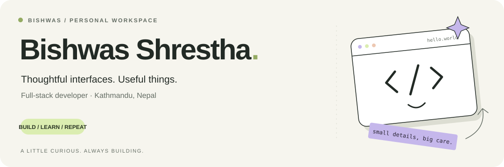
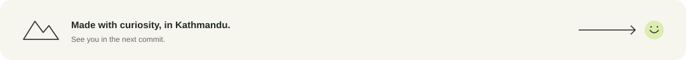

<!-- Upload this README and the assets/ folder to the root of BishwasGit/BishwasGit. -->

<picture>
  <source media="(prefers-color-scheme: dark)" srcset="./assets/hero-dark.svg">
  <source media="(prefers-color-scheme: light)" srcset="./assets/hero-light.svg">
  
</picture>

<p align="center">
  <a href="https://www.bishwas-shrestha.com.np"><b>Portfolio ↗</b></a> &nbsp; / &nbsp;
  <a href="mailto:workmail.bishwas@gmail.com">Say hello</a> &nbsp; / &nbsp;
  <a href="https://github.com/BishwasGit?tab=repositories">Explore my code</a>
</p>

## Hey, I'm Bishwas 👋

I build for the web, from the first screen to the API behind it. I work across **frontend and backend at O2D — On Demand Development**, with a soft spot for thoughtful interfaces, responsive design, and the small details that make an app feel good to use.

Based in **Kathmandu, Nepal**. Usually somewhere between a browser tab and a terminal.

### 01 / On my desk

- **Building** → Web applications, custom APIs, and responsive interfaces.
- **Learning** → Vite with React/Vue, plus CI/CD workflows.
- **Up for** → Collaborating on MERN, Laravel, WordPress, and API projects.

### 02 / A few things I've built

**[MCP Orchestrator ↗](https://github.com/BishwasGit/mcp-orchestrator)**  
Describe a task in plain language; the platform matches and executes the right MCP tool.  
<sub>TypeScript · NestJS · React / Vite · PostgreSQL</sub>

**[Google Sheets MCP ↗](https://github.com/BishwasGit/google-sheets-mcp)**  
A custom MCP server connecting Google Sheets to Claude on the web.  
<sub>JavaScript · Google Sheets · MCP</sub>

**[Buy / Sell Tickets ↗](https://github.com/BishwasGit/buy-sell-tickets)**  
An event ticket marketplace with QR verification and Stripe integration.  
<sub>JavaScript · Stripe · QR verification</sub>

<sub>[The rest of the workshop →](https://github.com/BishwasGit?tab=repositories)</sub>

### 03 / The toolkit

**In the browser**  
<picture>
  <source media="(prefers-color-scheme: dark)" srcset="./assets/stack-frontend-dark.svg">
  <source media="(prefers-color-scheme: light)" srcset="./assets/stack-frontend-light.svg">
  
</picture>

<sub>HTML · CSS · JavaScript · TypeScript · React · Vue · Vite · Bootstrap · MUI · jQuery</sub>

**Behind the scenes**  
<picture>
  <source media="(prefers-color-scheme: dark)" srcset="./assets/stack-backend-dark.svg">
  <source media="(prefers-color-scheme: light)" srcset="./assets/stack-backend-light.svg">
  
</picture>

<sub>PHP · Laravel · Node.js · Express · NestJS · WordPress · Python</sub>

**Where the data lives**  
<picture>
  <source media="(prefers-color-scheme: dark)" srcset="./assets/stack-data-dark.svg">
  <source media="(prefers-color-scheme: light)" srcset="./assets/stack-data-light.svg">
  
</picture>

<sub>MySQL · MongoDB · PostgreSQL</sub>

**From commit to deploy**  
<picture>
  <source media="(prefers-color-scheme: dark)" srcset="./assets/stack-delivery-dark.svg">
  <source media="(prefers-color-scheme: light)" srcset="./assets/stack-delivery-light.svg">
  
</picture>

<sub>Docker · Linux · Ubuntu · Git · GitHub · GitLab · Postman</sub>

**Design & the everyday**  
<picture>
  <source media="(prefers-color-scheme: dark)" srcset="./assets/stack-design-dark.svg">
  <source media="(prefers-color-scheme: light)" srcset="./assets/stack-design-light.svg">
  
</picture>

<sub>Figma · Photoshop · Illustrator · Notion · Discord</sub>

<details>
<summary>And a few tools around the edges</summary>

Figma, Photoshop, Illustrator, and Canva for design. jQuery when the project calls for it. Ubuntu, SSH, and cPanel for server work. GitHub and GitLab for code; Notion and Slack for keeping things together.

</details>

### 04 / A little behind the scenes

<details>
<summary><b>Open the activity drawer ↗</b></summary>

<br>

**Little by little**  
[Recent contributions →](https://github.com/BishwasGit) · [Public repositories →](https://github.com/BishwasGit?tab=repositories)

**Time at the keyboard**  
[](https://wakatime.com/@BishwasShrestha)

</details>

<details>
<summary>A tiny terminal Easter egg</summary>

```text
$ whoami
bishwas / developer / curious human

$ cat daily-loop.txt
learn → build → improve → repeat

$ echo "hello, visitor"
thanks for stopping by. look around :)
```

</details>

### 05 / Let's make something useful

Have a web app in mind, an API to connect, or a collaboration to explore? **[Drop me a line ↗](mailto:workmail.bishwas@gmail.com)**

[Portfolio](https://www.bishwas-shrestha.com.np) · [LinkedIn](https://www.linkedin.com/in/justbishwas/) · [Instagram](https://instagram.com/_bishwasshrestha) · [GitLab](https://gitlab.com/workmail.bishwas)

<br>

<picture>
  <source media="(prefers-color-scheme: dark)" srcset="./assets/footer-dark.svg">
  <source media="(prefers-color-scheme: light)" srcset="./assets/footer-light.svg">
  
</picture>
